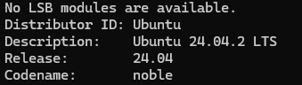
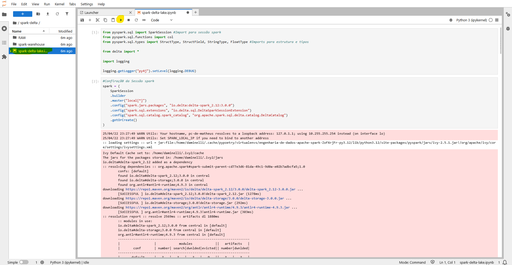

# APACHE SPARK COM DELTA LAKE E APACHE ICEBERG
> Trabalho de engenharia de dados com o tema: Apache spark com delta lake e apache iceberg.

## Tecnologias utilizadas
- Python
- Apache Spark
- Apache Iceberg
- Delta lake
- Jupyter lab

## Pré Requisitos
- Um ambiente virtual linux para que consiga rodar o projeto sem dificuldades.

## Recomendados: 
- Windows Subsystem for Linux [(WSL)](https://learn.microsoft.com/en-us/windows/wsl/install#install-wsl-command) para rodar somente por comandos 
- Máquina virtual Linux 

Para o desenvolvimento deste projeto foi utilizado o seguinte Linux: Ubuntu 24.04.



## Instalação
Caso não possua algum destes requisitos abaixo instalados, por favor, faça a instalação e, após isto, siga adiante.

Será necessario:
- [python](https://python.org.br/instalacao-linux/) vers: 3.12 ou mais recente (versao utilizada, 3.12 e 3.13)
- [java](https://cursos.alura.com.br/forum/topico-instalando-java-jdk-11-nas-distros-ubuntu-e-debian-159990) vers: 8 ou 11 preferencia na mais atualizada (11) 
- [pipx](https://pipx.pypa.io/stable/installation/)
- Este projeto utilizou o gerenciador de pacotes e dependências: [Poetry](https://python-poetry.org/docs/)

## Iniciando as variaveis de ambiente
- Alterando java home
```
echo 'export JAVA_HOME="/usr/lib/jvm/java-11-openjdk-amd64"' >> ~/.bashrc
echo 'export PATH="$JAVA_HOME/bin:$PATH"' >> ~/.bashrc
source ~/.bashrc
```

## Comandos utilizados para setup do ambiente
- Acessando o shell do poetry:
```poetry shell```
- Verificando atualizações de dependeências:
  ```poetry lock```
- Instalando dependências:
```poetry install ```
- Rodando o notebook
```jupyter-lab```

Entrar no link fornecido pelo jupyter-lab.

## Dentro do ambiente
Dentro do jupyter notebook você deve selecionar o arquivo ipynb, após escolher o arquivo, rodar as celulas uma por vez.



## Documentação


## Referências
Documentações utilizadas para suporte de código:

> [Delta Lake Docs](https://docs.delta.io/latest/index.html)

> [Apache iceberg Docs](https://iceberg.apache.org/docs/1.5.2/)

Repositórios consultados para desenvolvimento:
> [Projeto Apache Spark com Delta Lake](https://github.com/jlsilva01/spark-delta)

> [Projeto Apache Spark com Apache Iceberg](https://github.com/jlsilva01/spark-iceberg)

Turotial do Youtube
> [DataWay BR](https://www.youtube.com/watch?v=eOrWEsZIfKU&t=2365s) 

## Equipe
| [<br><sub>Jean Charles Guichard Guichard</sub>](https://github.com/Guichardx2) |  [<br><sub>Lucas da Rosa da Silva</sub>](https://github.com/Lorrust) |  [<br><sub>Matheus Augusto Daminelli</sub>](https://github.com/daminellis) |
| :---: | :---: | :---: |
